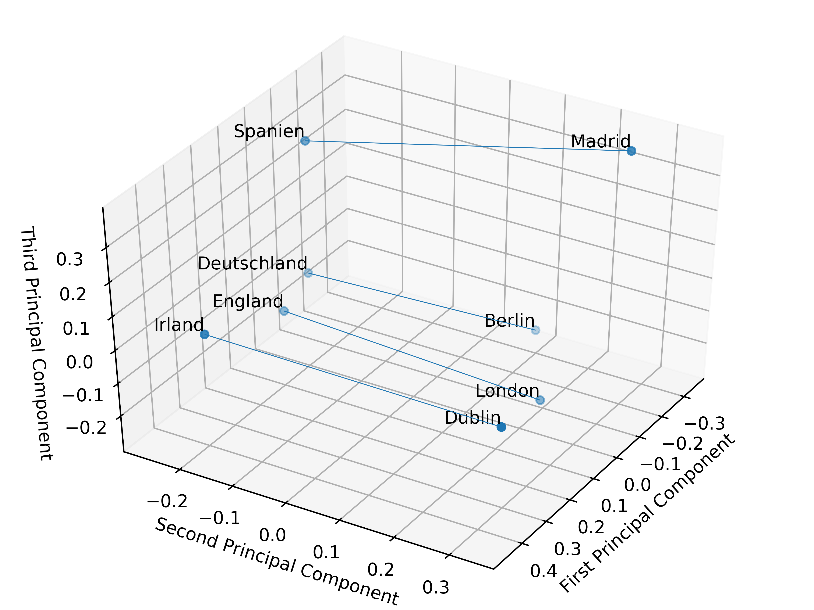

[](http://quantlet.de/)

## [](http://quantlet.de/) **MPT_Fast_Text_Visualization_Example** [](http://quantlet.de/)

```yaml

Name of QuantLet : MPT_Fast_Text_Visualization_Example

Published in : Masterthesis 'Estimation of Email Processing Time in the Financial Services Industry'

Description : 'Visualization Example for the Fast Text Word Embeddings. Pretrained FastText word embeddings vectors in German language are used. Dimensionality reduction fromm 300 to 3 via PCA. One sees, that the semantics are nicely extracted and capitals respectively countries are positioned close to each other and could be seperated along the second principal component.'

Keywords : 'Machine Learning (ML), NLP, Textual Analysis, Word Embeddings, SIF Embedding, FastText, PCA'

Author : Marvin Gauer

Submitted : Marvin Gauer

Output: 
  - Fast_Text_Visualization_Example_GIF.gif

```



### PYTHON Code
```python

import os
import sys
for p in ['numpy','pandas','gensim','scikit-learn','sh','matplotlib', 'xlrd', 'XlsxWriter','urllib']:
    if not p in sys.modules:
        print('Install {}'.format(p))
        pip = lambda: os.system('pip install {p}'.format(p=p))
        pip()

from gensim.models import FastText
from sklearn.decomposition import PCA
from matplotlib import pyplot
from mpl_toolkits.mplot3d.proj3d import proj_transform
from matplotlib.text import Annotation
from mpl_toolkits.mplot3d.art3d import Line3DCollection
import numpy as np
import urllib.request
from sh import gunzip

class Annotation3D(Annotation):

    def __init__(self, s, xyz, *args, **kwargs):
        Annotation.__init__(self,s, xy=(0,0), *args, **kwargs)
        self._verts3d = xyz

    def draw(self, renderer):
        xs3d, ys3d, zs3d = self._verts3d
        xs, ys, zs = proj_transform(xs3d, ys3d, zs3d, renderer.M)
        self.xy=(xs,ys)
        Annotation.draw(self, renderer)

def annotate3D(ax, s, *args, **kwargs):

    tag = Annotation3D(s, *args, **kwargs)
    ax.add_artist(tag)

def load_pretrained_FastText(embeding_model_filename = 'cc.de.300.bin'):
    print("--> Loading FastText model from ", embeding_model_filename)
    word_vectors_model = FastText.load_fasttext_format(embeding_model_filename, full_model=True)
    return word_vectors_model


# Moving animation
def make_views(ax, angles, elevation=None, width=4, height=4,
               prefix='tmprot_', **kwargs):

    files = []
    #ax.figure.set_size_inches(width, height)

    for i, angle in enumerate(angles):
        ax.view_init(elev=elevation, azim=angle)
        fname = '%s%03d.jpeg' % (prefix, i)
        ax.figure.savefig(fname, transparent=True)
        files.append(fname)

    return files

def make_gif(files, output, delay=100, repeat=True, **kwargs):

    loop = -1 if repeat else 0
    os.system('convert -coalesce -dispose 2 -transparent white -resize 600x600 -delay %d -loop %d %s %s'
              % (delay, loop, " ".join(files), output))

def rotanimate(ax, angles, output, **kwargs):

    output_ext = os.path.splitext(output)[1]

    files = make_views(ax, angles, **kwargs)

    D = {'.gif': make_gif}

    D[output_ext](files, output, **kwargs)

    for f in files:
        os.remove(f)

print('Download File -> This might take while. Filesize roughly 4.5 GB')
urllib.request.urlretrieve('https://dl.fbaipublicfiles.com/fasttext/vectors-crawl/cc.de.300.bin.gz', 'cc.de.300.bin.gz')
print('Finished Download -> Now Unzip')
gunzip('cc.de.300.bin.gz')

ft = load_pretrained_FastText()

# Example Sentences respectively words
example_sentence = [['Berlin'],['London'],['Madrid'],['Dublin'],['Deutschland'],['England'],['Spanien'],['Irland']]
example_vectors = [ft.wv[word] for sentence in example_sentence for word in sentence]

pca = PCA(n_components=3,random_state = 13)
result = pca.fit_transform(example_vectors)

angles = np.linspace(0,360,359)[:-1]
ax = pyplot.axes(projection='3d')
ax.scatter3D(result[:, 0], result[:, 1], result[:, 2])
ax.set_xlabel('First Principal Component')
ax.set_ylabel('Second Principal Component')
ax.set_zlabel('Third Principal Component')
pyplot.tight_layout()
pyplot.figure(figsize=(600, 600), dpi=100)

words = [word for sentence in example_sentence for word in sentence]
coord = zip(result[:, 0], result[:, 1], result[:, 2])
coord_list = list(coord)
edges = [(0,4),(1,5),(2,6),(3,7)]
segments = [(coord_list[s], coord_list[t]) for s, t in edges]

edge_col = Line3DCollection(segments, lw=0.2)
ax.add_collection3d(edge_col)

for word, coordinate in zip(words,coord_list):
    annotate3D(ax, s=word, xyz=coordinate, fontsize=10, xytext=None,
               textcoords='offset points', ha='right', va='bottom')
ax.view_init(elev=41., azim=31)

rotanimate(ax, angles,'Fast_Text_Visualization_Example_GIF.gif',delay=2, transparent=True)

```

automatically created on 2019-07-02